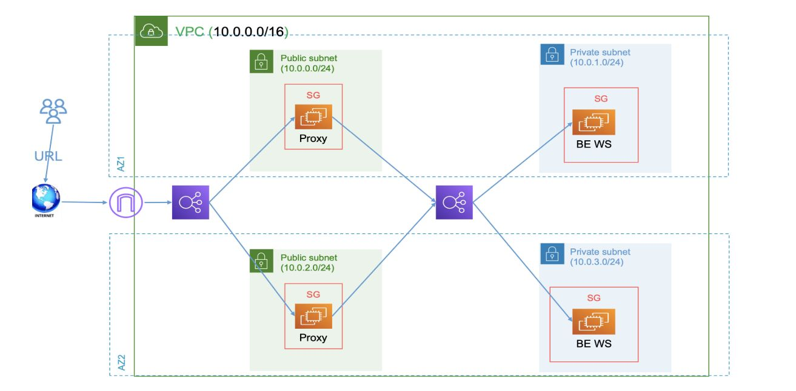

# AWS-IaC-using-Terraform
An AWS highly available and secure Infrastructure As Code using Terraform consists of 1 VPC, 4 subnets, 2 availability zones, 2 Load-Balancer, and 4 ec2.

# Way it works
The infrastructure comprises a Virtual Private Cloud (VPC) and an Internet gateway to enable Internet access for EC2 instances. It encompasses two public and two private EC2 instances, along with one public and one private load balancer. The public load balancer consists of a target group containing the two public EC2 instances which are configured with Nginx as a proxy to redirect traffic to the private load balancer. The private load balancer, on the other hand, includes a target group comprising the two private EC2 instances with Apache installed.

# Infrastructure Diagram

# Modules
The code is splitted into 11 modules
  1. **vpc** module to create the primary network infrastructure incluse the VPC and internet gateway.
  2. **subnet** module to create public and private subnet.
  3. **natGW** module to create Nat gateway and its elastic ip for private subnets.
  4. **ec2_public** module to create ec2 instances in public subnets.
  5. **ec2_private** module to create ec2 instances in private subnets.
  6. **AMI** module to bring the ami we want to use with ec2.
  7. **Security_group** module to create to use with ec2 and load-balancer.
  8. **SG_rule** module to create ingress and egress rules in SG to allow or disallow traffic.
  9. **load_balancer** module to create load-balancer to handel the traffic between thw ec2 instances.
  10. **s3-bucket** module to create s3 bucket.
  11 **dynamodb** module to create dynamodb table.

# Note
For robust state management, the code configured to apply a remote backend using an S3 bucket with versioning enabled to store multiple versions of the Terraform state file and a DynamoDB table to control resource locking during changing.
